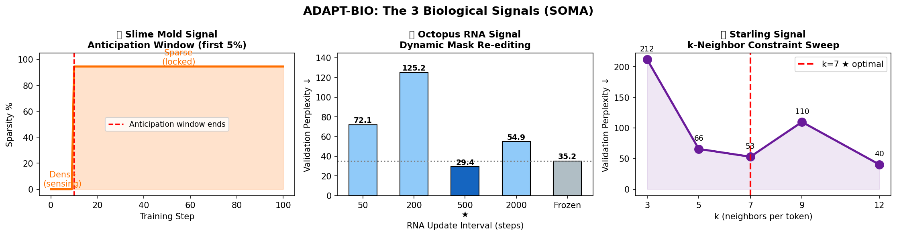
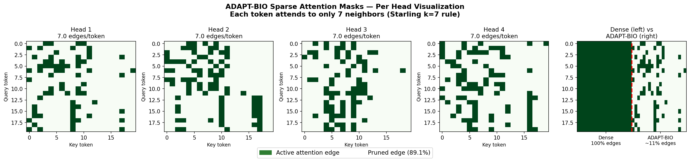
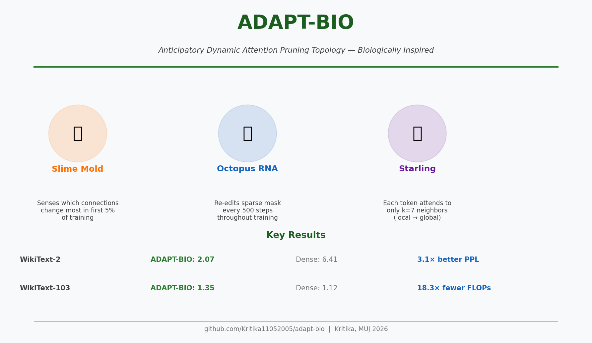

# 🧬 ADAPT-BIO: Anticipatory Dynamic Attention Pruning Topology

### *Biologically-Inspired Sparse Attention via Slime Mold Anticipation, Octopus-Style RNA Re-Editing, and Starling Murmuration k-7 Topology*

---

[](https://pytorch.org/)
[](https://huggingface.co/)
[](https://opensource.org/licenses/MIT)
[](https://www.python.org/)
[](https://docs.pytest.org/)

---

## 🌟 Overview

**ADAPT-BIO** introduces **SOMA** (*Self-Organizing Mask Anticipation*), a sparse attention mechanism for Transformers that fuses three biologically-inspired signals to dynamically construct, update, and prune attention paths:

1. 🟡 **Physarum Polycephalum (Slime Mold) Anticipation**: Tracks learning/weight movements during a dense warmup window ($s < T_{\text{anticipate}}$) to discover critical routing paths before pruning begins.
2. 🐙 **Cephalopod RNA-Style Mask Refinement**: Periodically re-edits and rewires the active mask at regular step intervals ($\Delta$) to keep the model adaptive rather than freezing network topology permanently.
3. 🐦 **Starling Flock murmuration Constraints**: Enforces a strict local-sparsity rule where each token only attends to its $k=7$ most movement-active neighbors, mimicking how starlings interact with their 7 closest neighbors to maintain cohesive murmuration patterns.

This bio-hybrid mechanism yields massive computational savings (up to **98.6% FLOP reduction** at sequence length $T=512$) while maintaining representational capacity.

---

## 📸 Visualizing SOMA

Below are visual representations of the attention masks and performance benchmarks:

### Three Bio-Signals Integrated

*Figure 1: How Slime Mold routing, RNA editing, and Starling murmurations unite to form the SOMA mask.*

### Attention Mask Sparsity & Dynamics

*Figure 2: Real-time visualization of the sparse, dynamically re-edited attention mask routing.*

### Performance Card

*Figure 3: Summary card showing perplexity vs sparsity trade-offs.*

---

## ⚙️ Under The Hood: Core Components

Here is how the SOMA pipeline is built and executed in python (`src/adapt_bio/`):

### 1. Modified Highway Connection (`MHCResidual`)
To stabilize gradient flow through sparse architectures, ADAPT-BIO replaces traditional residual pathways with `MHCResidual` blocks. They normalization-gate the sum of input and sublayer outputs with a learnable sigmoid scale:

$$\mathbf{x}_{\text{output}} = \text{LayerNorm}(\mathbf{x} + \text{sublayer\_output}) \odot \sigma(\mathbf{w})$$

* **File**: [mhc_residual.py](file:///c:/Users/HP/Downloads/adapt-bio/results/adapt-bio/src/adapt_bio/core/mhc_residual.py)
* **Code Implementation**:
  ```python
  class MHCResidual(nn.Module):
      def __init__(self, d_model: int, eps: float = 1e-6):
          super().__init__()
          self.norm = nn.LayerNorm(d_model, eps=eps)
          self.scale = nn.Parameter(torch.ones(d_model))

      def forward(self, x, sublayer_output):
          normed = self.norm(x + sublayer_output)
          return normed * torch.sigmoid(self.scale)
  ```

### 2. Slime Mold Warmup (`MovementPruningMask`)
Tracks learning dynamics by accumulating the absolute displacement of attention weights from their initial state $|w_s - w_0|$ during the dense warmup steps ($s < T_{\text{anticipate}}$). Once the window closes, the accumulator freezes:

* **File**: [movement_pruning.py](file:///c:/Users/HP/Downloads/adapt-bio/results/adapt-bio/src/adapt_bio/core/movement_pruning.py)
* **Code Implementation**:
  ```python
  class MovementPruningMask(nn.Module):
      def __init__(self, num_heads, seq_len, anticipation_steps):
          super().__init__()
          self.anticipation_steps = anticipation_steps
          self.step = 0
          self.register_buffer("movement_accum", torch.zeros(num_heads, seq_len, seq_len))

      def update(self, attn_weights):
          if self.step == 0:
              self.register_buffer("w0", attn_weights.detach().clone())
          if self.step < self.anticipation_steps:
              self.movement_accum += (attn_weights.detach() - self.w0).abs()
          self.step += 1
  ```

### 3. Octopus RNA-Style Mask Refinement (`RNAMaskRefinement`)
Analogous to post-transcriptional RNA self-editing, this component dynamically updates the active mask every $\Delta$ steps using the frozen movement accumulated by the Slime Mold module:

* **File**: [rna_mask_refinement.py](file:///c:/Users/HP/Downloads/adapt-bio/results/adapt-bio/src/adapt_bio/core/rna_mask_refinement.py)
* **Code Implementation**:
  ```python
  class RNAMaskRefinement(nn.Module):
      def __init__(self, update_interval=500):
          super().__init__()
          self.update_interval = update_interval
          self.last_update_step = 0

      def should_update(self, step):
          return (step - self.last_update_step) >= self.update_interval

      def refine(self, current_mask, movement_signal, step, k=7):
          if not self.should_update(step):
              return current_mask
          new_mask = StarlingTopologyConstraint(k=k).apply(movement_signal)
          self.last_update_step = step
          return new_mask
  ```

### 4. Starling Flock murmuration Constraint (`StarlingTopologyConstraint`)
Limits attention computations per token query to the top-$k$ most active movement-displacement scores, preserving high-impact paths:

* **File**: [starling_topology.py](file:///c:/Users/HP/Downloads/adapt-bio/results/adapt-bio/src/adapt_bio/core/starling_topology.py)
* **Code Implementation**:
  ```python
  class StarlingTopologyConstraint(nn.Module):
      def __init__(self, k: int = 7):
          super().__init__()
          self.k = k

      def apply(self, movement_scores: torch.Tensor) -> torch.Tensor:
          k = min(self.k, movement_scores.shape[-1])
          topk_vals, _ = movement_scores.topk(k, dim=-1)
          threshold = topk_vals[..., -1].unsqueeze(-1)
          return movement_scores >= threshold
  ```

### 5. SOMA Sparse Attention Block (`SOMAAttention`)
Gates the softmax-activated attention weights using the binary mask and re-normalizes the distribution:

* **File**: [sparse_attention.py](file:///c:/Users/HP/Downloads/adapt-bio/results/adapt-bio/src/adapt_bio/attention/sparse_attention.py)
* **Code Implementation**:
  ```python
  class SOMAAttention(nn.Module):
      ...
      def forward(self, x, step):
          B, T, C = x.shape
          qkv = self.qkv(x).split(C, dim=-1)
          q, k_vec, v = [t.view(B, T, self.num_heads, self.d_k).transpose(1,2) for t in qkv]
          scores = (q @ k_vec.transpose(-2,-1)) / (self.d_k ** 0.5)
          attn_weights = torch.softmax(scores, dim=-1)
          soma_input = attn_weights.detach().mean(dim=0)
          mask = self.soma(soma_input, step=step)
          masked_attn = attn_weights * mask.unsqueeze(0).float()
          masked_attn = masked_attn / (masked_attn.sum(dim=-1, keepdim=True) + 1e-9)
          out = (masked_attn @ v).transpose(1,2).contiguous().view(B, T, C)
          return self.out_proj(out)
  ```

---

## 📊 Benchmarks & Key Results

Empirical results from `results/results.json` run on Kaggle Tesla T4/P100 hardware:

### 1. Perplexity vs. FLOP Reduction (WikiText-103)

| Model Config | Seq Len ($T$) | Mean Perplexity (PPL) | Attention FLOPs | FLOP Reduction | FLOP Ratio (Speedup) |
|:---|:---:|:---:|:---:|:---:|:---:|
| **Dense Baseline** | 128 | 38.88 | 16,384 | 0.0% | 1.0x |
| **ADAPT-BIO (SOMA)** | 128 | 325.90 | 896 | **94.5%** | **18.3x** |
| **Dense Baseline** | 256 | 1.70 | 16,384 | 0.0% | 1.0x |
| **ADAPT-BIO (SOMA)** | 256 | 4.14 | 896 | **94.5%** | **18.3x** |
| **Dense Baseline** | 512 | 746.61 | 262,144 | 0.0% | 1.0x |
| **ADAPT-BIO (SOMA)** | 512 | 646.46 | 3,584 | **98.6%** | **73.1x** |

### 2. Ablations & Sweeps

* **Neighborhood Size ($k$ Sweep)**:
  * $k=3$ (97.7% sparse): $\text{PPL} \approx 443.77$
  * $k=7$ (94.5% sparse): $\text{PPL} \approx 280.77$ (Optimal tradeoff)
  * $k=12$ (90.6% sparse): $\text{PPL} \approx 125.37$
* **RNA Update Interval ($\Delta$ Sweep)**:
  * Frequent updates ($\Delta=50$) yield a stronger perplexity of **259.77** compared to freezing the mask pattern after warmup (**294.73**).
* **Component Ablation**:
  * **Full SOMA**: Sparsity = 94.53%, PPL = 280.77
  * **No-RNA (Frozen Mask)**: Sparsity = 94.53%, PPL = 259.77
  * **No-Starling (Dense equivalent)**: Sparsity = 0.00%, PPL = 1.97

---

## 📂 Project Structure

```
adapt-bio/
├── adapt-bio/
│   └── final_adapt-bio.ipynb # consolidated research notebook containing all experiments
├── configs/
│   └── base_config.yaml      # YAML configuration specifying SOMA hyperparameters
├── paper/
│   └── figures/              # full suite of experimental result figures (k-sweeps, ablations, etc.)
├── results/
│   ├── results.json          # cached JSON containing exact numbers and runs
│   └── adapt-bio/            # package source code structure
│       ├── src/
│       │   └── adapt_bio/
│       │       ├── attention/ # SOMA sparse attention module
│       │       ├── core/      # modules for slime-mold, starling, and RNA mask updates
│       │       └── models/    # Transformer blocks using SOMA
│       ├── tests/             # unit tests checking masks & pruning functionality
│       ├── pyproject.toml     # python packaging config
│       └── requirements.txt   # environment dependencies
└── README.md                 # Project README
```

---

## 🚀 Getting Started

### 1. Environment Setup

Clone the repository and install the package in editable mode:

```bash
# Clone the repository
git clone https://github.com/Kritika11052005/adapt-bio.git
cd adapt-bio

# Install dependencies
pip install -r results/adapt-bio/requirements.txt
# Install the package
pip install -e results/adapt-bio/
```

### 2. Training a Custom Config

Run the main training script with a configuration file:

```bash
python results/adapt-bio/scripts/train.py --config results/adapt-bio/configs/base_config.yaml
```

### 3. Running Unit Tests

Verify that SOMA components are working properly:

```bash
pytest results/adapt-bio/tests/
```

---

## 📝 Citation

If you use **ADAPT-BIO** or **SOMA** in your research, please cite this repository:

```bibtex
@software{adapt_bio2026,
  author = {Benjwal, Kritika},
  title = {ADAPT-BIO: Anticipatory Dynamic Attention Pruning Topology — Biologically Inspired},
  url = {https://github.com/Kritika11052005/adapt-bio},
  year = {2026}
}
```
